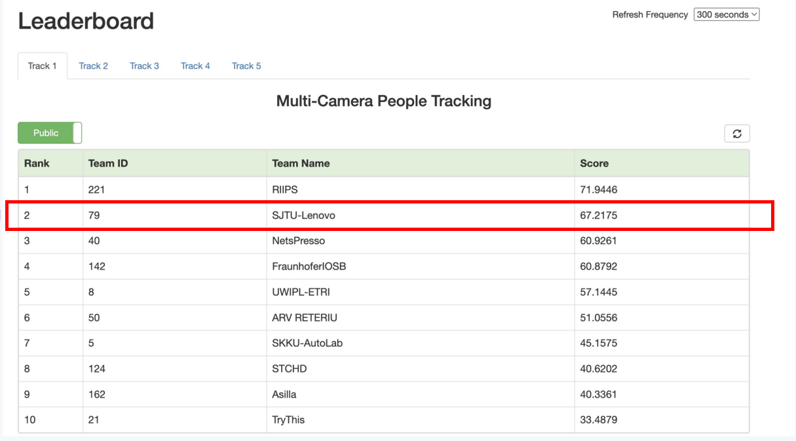
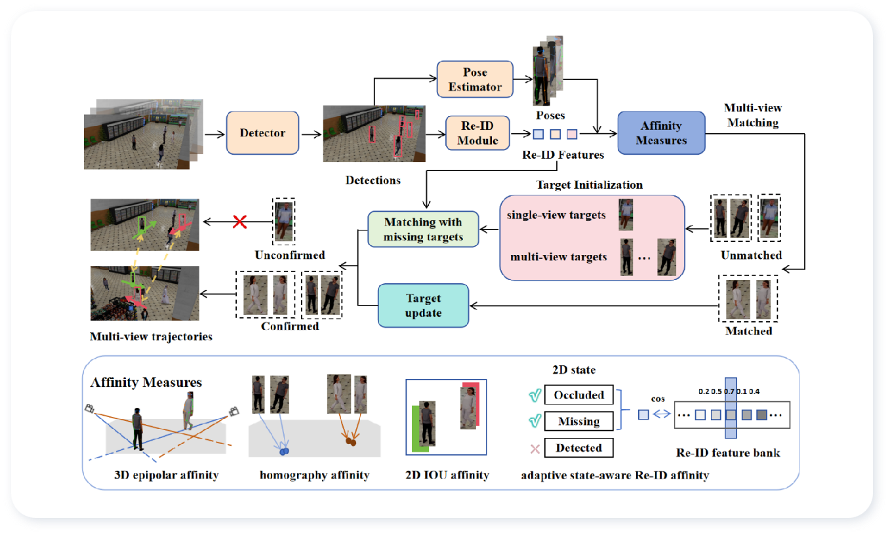

# CVPRW2024: A Robust Online Multi-Camera People Tracking System With Geometric Consistency and State-aware Re-ID Correction

This is the official repository for the 2nd place submission to the 8th NVIDIA AI City Challenge (2024) Track 1: Multi-Camera People Tracking.

## Ranking 



## Overall Pipeline



## Dataset

The official dataset can be downloaded from [the AI City Challenge website](https://www.aicitychallenge.org/2024-data-and-evaluation/). You need to fill out the dataset request form to obtain the password to download them.

The dataset should be placed in the `dataset` folder as follows:

```
dataset
├── train
├── val
└── test
```

## Environment Setup

### 1. Create and Activate the Conda Environment:

```bash
conda create -n aic24 python=3.9 pytorch torchvision pytorch-cuda=11.8 -c pytorch -c nvidia
conda activate aic24
pip install -r requirements.txt
pip install -e track/aic_cpp
pip install openmim
mim install "mmengine>=0.6.0"
mim install "mmcv>=2.0.1"
mim install "mmpose>=1.1.0"
pip3 install 'git+https://github.com/cocodataset/cocoapi.git#subdirectory=PythonAPI'
```

### 2. Installation for torch2trt (Optional)
If you want to accelerate the speed of object detection, you may install torch2trt. See [torch2trt](https://github.com/NVIDIA-AI-IOT/torch2trt).

## Training
### Train Re-ID model (skip for fast reproduction)
```
script/reid_train.sh
```

Download our [sampled dataset](https://drive.google.com/file/d/13OObd7baOq2NYedShAt4-ZaDBteD8MtA/view?usp=sharing) and unzip it under `fast-reid` folder.

## Inferencing
### 1. Prepare Pre-trained weights

Download the pretrained weights from [ByteTrack Yolox](https://drive.google.com/file/d/1LVFqYqx88R0TUjCMbTaKrJkL7-SdCSmC/view?usp=drive_link), [LUPerson Resnet](https://drive.google.com/file/d/1xDKWJRWja01nNOeV7TWcn58sHYSal2k9/view?usp=drive_link) and [Hrnet](https://drive.google.com/file/d/1tNT6gOBB95qYPCypvCctj1o-r7bzdwxA/view?usp=drive_link). Put all these pretrained weights in the `ckpt_weight` folder.

### 2. Detection
You can choose between the accelerated method detailed in step 2.1, which utilizes torch2trt, or the standard method described in step 2.2 if you prefer not to use it.

#### 2.1 Accelerated Detection
```
python ./detection/utils/trt.py
script/fast_detection.sh
```
#### 2.2 Standard Detection
```
script/standard_detection.sh
```

**Note:** Based on the actual hardware conditions, you can modify the values of `gpu_nums_per_iter`, `cpu_nums_per_iter`, and `scene_per_iter` in the shell script to achieve faster speeds or lower resource usage. In extreme cases, setting all three to 1 can accommodate the minimum hardware requirements. The same considerations regarding hardware configuration adjustments apply to the following scripts. 

### 3. Pose Estimation
```
script/pose_estimation.sh
```

### 4. Re-ID

Download the weight from [ReID model](https://drive.google.com/file/d/17qbBmBX7DiT2lOuQ6rGHl8s9deKHkVn2/view?usp=sharing). Put this finetuned weight in the `ckpt_weight` folder.

```
script/reid_infer.sh
```


### 5. Tracking
```
script/run_track.sh
```

### 6. Generate final submission
```
python3 track/generate_submission.py
```

The final result is located in `result/track.txt`. You can compress it and upload it to the AIC24 evaluation system.